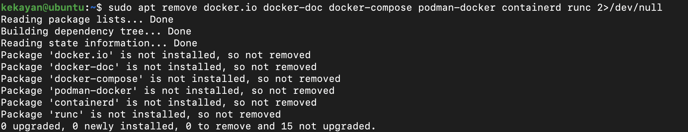
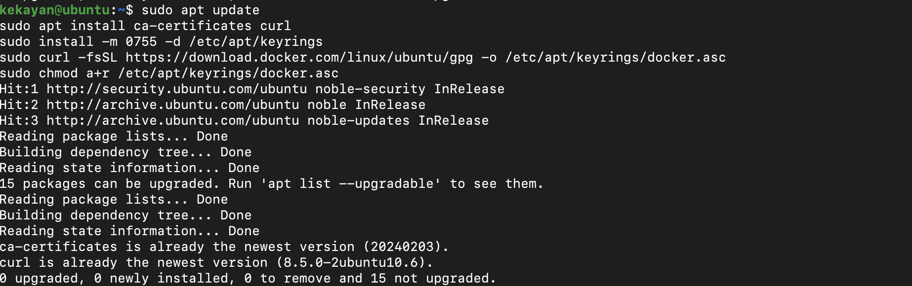
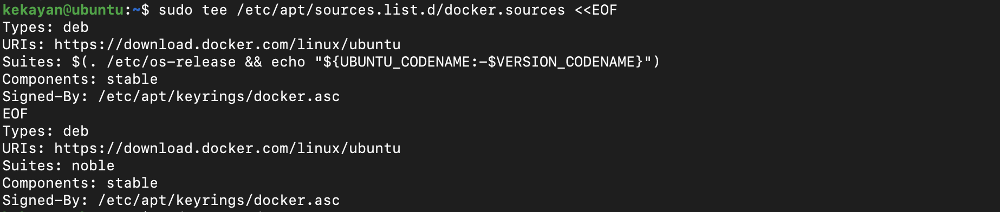
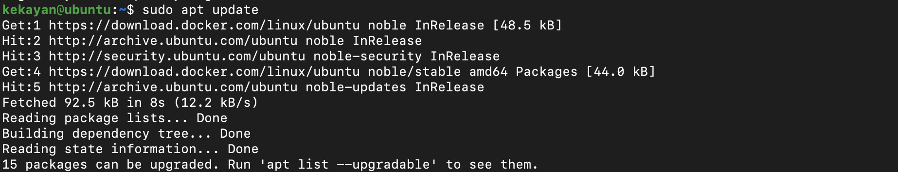
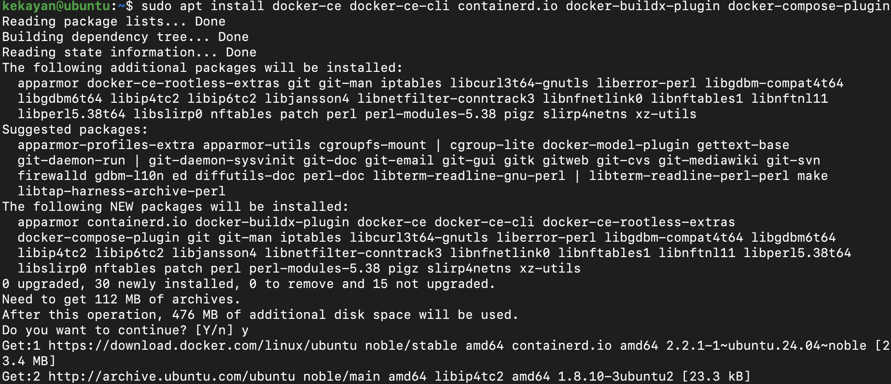
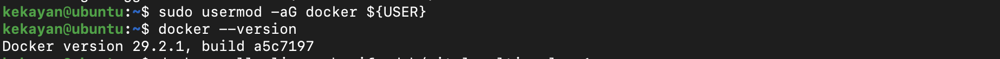

import { Tabs, Tab } from 'fumadocs-ui/components/tabs';

This guide walks you through installing Docker on your operating system.

## Prerequisites

<Tabs groupId="os" items={['Linux', 'macOS', 'Windows']}>
  <Tab value="Linux">
A 64-bit Linux distribution with `sudo` privileges and terminal access. Supported distros include **Ubuntu** 22.04+, **Debian** 12+, and **Fedora** 41+.
  </Tab>
  <Tab value="macOS">
**macOS 14 (Sonoma) or later** with at least 4GB of RAM. Works with Apple Silicon or Intel chips. Docker supports the current macOS release and the two previous major versions.
  </Tab>
  <Tab value="Windows">
**Windows 10 64-bit** (Pro, Enterprise, or Education, version 22H2 / Build 19045+) or **Windows 11** (version 23H2 / Build 22631+). Requires WSL 2 version 2.1.5+ (recommended) or Hyper-V, at least 4GB of RAM, and BIOS-level hardware virtualization enabled.
  </Tab>
</Tabs>

## Installation

<Tabs groupId="os" items={['Linux', 'macOS', 'Windows']}>
  <Tab value="Linux">

<Tabs groupId="distro" items={['Ubuntu / Debian', 'Fedora']}>
  <Tab value="Ubuntu / Debian">

### Step 1: Remove Conflicting Packages

```bash
sudo apt remove docker.io docker-doc docker-compose podman-docker containerd runc 2>/dev/null
```



### Step 2: Set Up Docker's Repository

```bash
sudo apt update
sudo apt install ca-certificates curl
sudo install -m 0755 -d /etc/apt/keyrings
sudo curl -fsSL https://download.docker.com/linux/ubuntu/gpg -o /etc/apt/keyrings/docker.asc
sudo chmod a+r /etc/apt/keyrings/docker.asc
```



Add the repository to apt sources:

```bash
sudo tee /etc/apt/sources.list.d/docker.sources <<EOF
Types: deb
URIs: https://download.docker.com/linux/ubuntu
Suites: $(. /etc/os-release && echo "${UBUNTU_CODENAME:-$VERSION_CODENAME}")
Components: stable
Signed-By: /etc/apt/keyrings/docker.asc
EOF
```



```bash
sudo apt update
```



> **Debian users:** Replace `ubuntu` with `debian` in the `curl` and `tee` commands above, and use `$VERSION_CODENAME` instead of `${UBUNTU_CODENAME:-$VERSION_CODENAME}` in the `Suites` line.

### Step 3: Install Docker Engine and Docker Compose

```bash
sudo apt install docker-ce docker-ce-cli containerd.io docker-buildx-plugin docker-compose-plugin
```



### Step 4: Run Docker Without Sudo (Recommended)

```bash
sudo usermod -aG docker ${USER}
```



Log out and log back in for changes to take effect.

> For the full official guide, see the [Docker Engine on Ubuntu](https://docs.docker.com/engine/install/ubuntu/) or [Docker Engine on Debian](https://docs.docker.com/engine/install/debian/) documentation.

  </Tab>
  <Tab value="Fedora">

### Step 1: Remove Conflicting Packages

```bash
sudo dnf remove docker docker-client docker-client-latest docker-common \
  docker-latest docker-latest-logrotate docker-logrotate \
  docker-selinux docker-engine-selinux docker-engine 2>/dev/null
```

### Step 2: Set Up Docker's Repository

```bash
sudo dnf config-manager addrepo --from-repofile=https://download.docker.com/linux/fedora/docker-ce.repo
```

### Step 3: Install Docker Engine and Docker Compose

```bash
sudo dnf install docker-ce docker-ce-cli containerd.io docker-buildx-plugin docker-compose-plugin
```

### Step 4: Start and Enable Docker

```bash
sudo systemctl enable --now docker
```

### Step 5: Run Docker Without Sudo (Recommended)

```bash
sudo usermod -aG docker ${USER}
```

Log out and log back in for changes to take effect.

> For the full official guide, see the [Docker Engine on Fedora](https://docs.docker.com/engine/install/fedora/) documentation.

  </Tab>
</Tabs>

> For other distributions, see the [Docker Engine installation documentation](https://docs.docker.com/engine/install/).

  </Tab>
  <Tab value="macOS">
### Option A: Docker Desktop (Recommended)

Download [Docker Desktop for Mac](https://www.docker.com/products/docker-desktop/). Choose **Apple Silicon** or **Intel chip** based on your Mac. Open the `.dmg` file, drag Docker to Applications, then launch Docker and accept the service agreement.

**Apple Silicon users:** Optionally install Rosetta 2 for better compatibility with x86/amd64 images:

```bash
softwareupdate --install-rosetta
```

### Option B: Using Homebrew

```bash
brew install --cask docker
```

Then launch Docker from Applications.

> For the full official guide, see the [Docker Desktop for Mac documentation](https://docs.docker.com/desktop/setup/install/mac-install/).
  </Tab>
  <Tab value="Windows">
### Step 1: Enable WSL 2

Open PowerShell as Administrator and run:

```powershell
wsl --install
```

This enables all required features and installs WSL 2 with a default Linux distribution. Restart your computer when prompted.

After restarting, verify WSL 2 is active:

```powershell
wsl --version
```

Ensure the WSL version is **2.1.5 or later**. If not, update it:

```powershell
wsl --update
```

### Step 2: Install Docker Desktop

Download [Docker Desktop for Windows](https://www.docker.com/products/docker-desktop/). Run the installer and select **Use WSL 2 instead of Hyper-V**. Follow the installation wizard, then launch Docker Desktop from the Start menu.

> For the full official guide, see the [Docker Desktop for Windows documentation](https://docs.docker.com/desktop/setup/install/windows-install/).
  </Tab>
</Tabs>

## Verify Installation

<Tabs groupId="os" items={['Linux', 'macOS', 'Windows']}>
  <Tab value="Linux">
```bash
docker --version
docker compose version
docker run hello-world
```
  </Tab>
  <Tab value="macOS">
```bash
docker --version
docker compose version
docker run hello-world
```
  </Tab>
  <Tab value="Windows">
```powershell
docker --version
docker compose version
docker run hello-world
```
  </Tab>
</Tabs>

## Troubleshooting

<Tabs groupId="os" items={['Linux', 'macOS', 'Windows']}>
  <Tab value="Linux">
### Permission Denied Error

```bash
# Verify docker group membership
groups ${USER}

# Re-add to docker group if needed
sudo usermod -aG docker ${USER}

# Log out and back in
```

### Docker Service Not Starting

```bash
sudo systemctl status docker
sudo journalctl -u docker.service
```

### Conflicting Signed-By Error (Ubuntu)

If you see this error when running `apt update`:

```
E: Conflicting values set for option Signed-By regarding source https://download.docker.com/linux/ubuntu jammy: /etc/apt/keyrings/docker.gpg != /etc/apt/keyrings/docker.asc
E: The list of sources could not be read.
```

Remove the conflicting source and run update again:

```bash
sudo rm /etc/apt/sources.list.d/docker.list
sudo apt update
```

Then continue with the installation steps from Step 2 onwards.
  </Tab>
  <Tab value="macOS">
### Docker Desktop Won't Start

Check virtualization support:

```bash
sysctl -a | grep machdep.cpu.features
```

Try resetting: Docker icon → Troubleshoot → Reset to factory defaults

### Permission Issues

```bash
sudo chown "$USER":staff ~/.docker -R
sudo chmod g+rwx ~/.docker -R
```

### Apple Silicon Performance

Enable Rosetta for x86 images: Docker Desktop Settings → Features in development → Use Rosetta for x86/amd64 emulation
  </Tab>
  <Tab value="Windows">
### WSL 2 Issues

```powershell
wsl --status
wsl --update
wsl --list --verbose
```

### Virtualization Not Enabled

Enter BIOS/UEFI settings during boot and enable Intel VT-x or AMD-V.

### Permission Errors

```powershell
# Run as Administrator
net localgroup docker-users "YOUR_USERNAME" /add
```

Log out and back in.

### Slow Performance

Create `%USERPROFILE%\.wslconfig`:

```
[wsl2]
memory=4GB
processors=2
```

Then restart WSL: `wsl --shutdown`
  </Tab>
</Tabs>

## Useful Commands

| Command | Description |
|---------|-------------|
| `docker ps` | List running containers |
| `docker ps -a` | List all containers |
| `docker images` | List downloaded images |
| `docker pull <image>` | Download an image |
| `docker run <image>` | Run a container |
| `docker stop <container>` | Stop a container |
| `docker rm <container>` | Remove a container |
| `docker compose up` | Start services defined in `docker-compose.yml` |
| `docker compose down` | Stop and remove services |
| `docker system prune` | Clean up unused resources |
